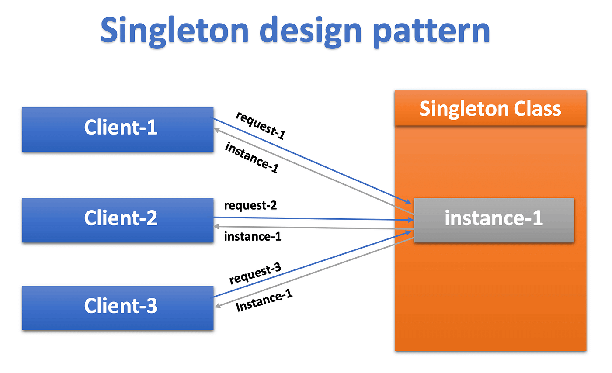

# 싱글톤 패턴

## 개요

싱글톤패턴이란 하나의 클래스에 오직 하나의 인스턴스만 가지는 패턴을 말한다. 인스턴스 생성에 많은 비용이 드는 데이터 베이스 연결 모듈에 많이 쓰이며, 인스턴스 생성을 효율적으로 한다는 장점이 있다. 그러나, 의존성이 높아지고 TDD(테스트주도개발)를 할 때 불편한 단점이 있다.



### 싱글톤이 아닌 클래스 예시

```JavaScript
class Rectangle {
    constructor(height, width) {
        this.height = height;
        this.width = width;
    }
 }
 const a = new Rectangle(1, 2)
 const b = new Rectangle(1, 2)
 console.log(a === b) // false
```

### 싱글톤패턴 예시 - JavaScript

```JavaScript
 class Singleton {

    constructor() {
        if (!Singleton.instance) {
            Singleton.instance = this
        }
        return Singleton.instance
    }
    getInstance() {
        return this
    }
 }
 const a = new Singleton()
 const b = new Singleton()
 console.log(a === b) // true
```

### 싱글톤패턴 예시 - JAVA

```Java
 class Singleton {
    private static class singleInstanceHolder {
        private static final Singleton INSTANCE = new Singleton();
    }
    public static Singleton getInstance() {
        return singleInstanceHolder.INSTANCE;
    }
    }
    public class HelloWorld{
        public static void main(String []args){
            Singleton a = Singleton.getInstance();
            Singleton b = Singleton.getInstance();
            System.out.println(a.hashCode());
            System.out.println(b.hashCode());
            if (a == b){
            System.out.println(true);
            }
    }
 }
 /*
 705927765
 705927765
 true
 1. 클래스안에 클래스(Holder), static이며 중첩된 클래스인 singleInstanceHolder를 기반으로 객체를 선언했기 때문에 한 번만 로드되므로 싱글톤 클래스의 인스턴스는 애플리케이션 당 하나만 존재하며 클래스가 두 번 로드되지 않기 때문에 두 스레드가 동일한 JVM에서 2개의 인스턴스를 생성할 수 없다. 그렇기 때문에 동기화, 즉 synchronized를 신경쓰지 않아도 된다.
 2. final 키워드를 통해서 read only 처리, 다시 값이 할당되지 않도록 설정.
 3. 중첩클래스 Holder로 만들었기 때문에 싱글톤 클래스가 로드될 때 클래스가 메모리에 로드되지 않고 어떠한 모듈에서 getInstance()메서드가 호출할 때 싱글톤 객체를 최초로 생성 및 리턴하게 된다.
 */
```

### 결론

싱글톤 패턴은 특정 상황(글로벌 상태 관리, 자주 조회되는 데이터 캐싱, 세션 관리 등)에서 매우 유용하지만, 남용을 피하고 적절한 시점에만 사용하는 것이 중요하다. 이를 통해 코드의 가독성과 유지보수성을 높일 수 있다.