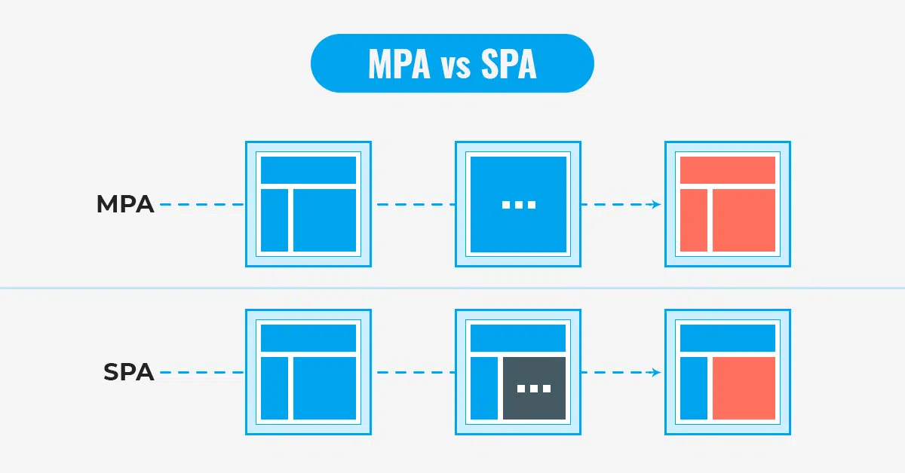

# SPA vs MPA 개념과 렌더링 방식 비교

## 개요

웹 애플리케이션 개발에서 중요한 두 가지 아키텍처 패턴인 SPA(Single Page Application)와 MPA(Multiple Page Application)에 대해 살펴보겠습니다.

이 글에서는 각각의 개념과 장단점, 그리고 관련된 렌더링 방식인 CSR(Client Side Rendering)과 SSR(Server Side Rendering)에 대해 설명합니다.

## SPA(Single Page Application)

### 개념

한 개(Single)의 Page로 구성된 Application입니다.

최초로 웹 애플리케이션에 접속할 때 필요한 모든 정적 리소스(HTML, CSS, JavaScript)를 한 번에 다운로드합니다.

이후 새로운 페이지 요청이 있을 때 전체 페이지를 다시 로드하지 않고, 가상 DOM(Virtual DOM)을 사용하여 변경된 부분만 업데이트합니다.

### 장점

1. **사용자 경험(UX) 향상**: 페이지 이동이나 리렌더링 시 변경된 부분만 업데이트하므로 깜빡거림 없이 빠른 반응을 보입니다.
2. **로컬 스토리지 캐싱**: 초기 로딩 후 필요한 리소스만 부분적으로 로딩하여 성능이 향상됩니다.
3. **모바일 친화적**: 동일한 백엔드 API를 사용할 수 있어 모바일 애플리케이션 개발과의 연계가 용이합니다.
4. **개발 간소화**: 서버에서 페이지를 렌더링하기 위한 코드를 작성할 필요 없이 클라이언트 측에서 대부분의 작업을 처리할 수 있습니다.

### 단점

1. **초기 구동 속도**: 모든 정적 리소스를 한 번에 다운로드하기 때문에 초기 로딩 속도가 느릴 수 있습니다.
2. **SEO 문제**: 자바스크립트로 페이지를 렌더링하기 때문에 검색 엔진 최적화(SEO)가 어렵습니다.
3. **보안 문제**: 클라이언트 측에서 비즈니스 로직을 처리하기 때문에 보안 취약점이 생길 수 있습니다.

## MPA(Multiple Page Application)

### 개념

MPA는 여러 개의 Page로 구성된 Application입니다.

사용자가 새로운 페이지를 요청할 때마다 서버에서 완전히 새로운 페이지를 렌더링하여 제공받습니다.

각 페이지는 독립적으로 로드되며, 서버에서 렌더링된 HTML, CSS, JavaScript 파일이 매번 다운로드됩니다.

### 장점

1. **SEO 친화적**: 서버에서 완성된 HTML 파일을 제공하기 때문에 검색 엔진이 페이지를 쉽게 크롤링할 수 있습니다.
2. **첫 로딩 속도**: 서버에서 이미 렌더링된 페이지를 전달받기 때문에 첫 로딩 속도가 빠릅니다.

### 단점

1. **페이지 이동 시 느린 속도**: 새로운 페이지로 이동할 때마다 전체 페이지를 다시 로드해야 하므로 속도가 느립니다.
2. **복잡한 개발**: 클라이언트와 서버 모두에서 프레임워크를 사용해야 하므로 개발이 복잡해질 수 있습니다.
3. **서버 부하 증가**: 매 페이지 요청 시 서버에서 렌더링 작업이 필요하므로 서버 부하가 증가합니다.

## CSR vs SSR

### CSR(Client Side Rendering)

CSR은 클라이언트 측에서 JavaScript를 사용하여 페이지를 렌더링하는 방식입니다. 주로 SPA에서 사용되며, 페이지 이동 시 깜빡거림이 없고 사용자 경험이 좋습니다. 그러나 초기 로딩 속도가 느릴 수 있으며, SEO에 불리합니다.

### SSR(Server Side Rendering)

SSR은 서버에서 HTML 페이지를 렌더링하여 클라이언트에 전달하는 방식입니다. MPA에서 사용되고, SEO에 유리하고 첫 로딩 속도가 빠릅니다. 그러나 매번 페이지 이동 시 서버 부하가 증가하고, 사용자가 페이지 이동 시 깜빡거림을 경험할 수 있습니다.

### SPA의 SSR 지원

SPA도 SSR을 지원할 수 있습니다.

Vue.js는 Nuxt.js 프레임워크, React.js는 Next.js 프레임워크, node.js는 Nest.js 프레임워크를 통해 SSR을 적용할 수 있습니다. 이는 초기 로딩 속도를 개선하고 SEO 문제를 해결하는 데 도움을 줍니다.

- **SSR**: 서버에서 HTML을 미리 렌더링하여 클라이언트에 전달합니다.
- **SSG**: 빌드 시 HTML을 미리 생성하여 정적으로 호스팅합니다.
- **ISR**: 일부 페이지를 정적으로 생성하되, 특정 간격으로 다시 생성하여 최신 데이터를 반영합니다.

## 결론

SPA와 MPA는 장단점이 있으며, 애플리케이션의 목적과 요구사항에 따라 선택하면 됩니다.

전자상거래 사이트처럼 많은 콘텐츠와 페이지가 필요한 경우 MPA가 적합하고, 소셜 플랫폼이나 모바일 친화적인 애플리케이션을 개발하려면 SPA가 더 나은 선택이 될 수 있습니다.

## 참고 자료

- [SPA와 MPA 비교](https://poiemaweb.com/js-spa)
- [웹 렌더링 방식](https://web.dev/rendering-on-the-web/)
- [SPA와 MPA의 장단점](https://medium.com/@NeotericEU/single-page-application-vs-multiple-page-application-2591588efe58)
- [Nuxt.js 소개](https://hanamon.kr/nuxt-js-%eb%9e%80/)
- [SPA vs MPA - velog](https://velog.io/@yejine2/SPASingle-Page-Application-VS-MPA)
