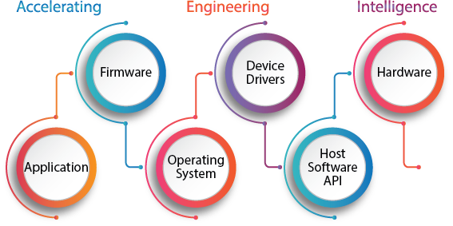

# Firmware

- [Embedded Systems](#embedded-systems)
- [펌웨어](#펌웨어)
    - [FW vs Driver](#fw-vs-driver)
    - [펌웨어의 종류](#펌웨어의-종류)
        - [BIOS](#bios) 
        - [UEFI](#uefi)
        - [BIOS vs UEFI](#bios-vs-uefi)
    - [부트로더](#부트로더)
    - [펌웨어 개발 과정](#펌웨어-개발-과정)
- [HW vs FW vs SW](#hw-vs-fw-vs-sw)
    - [HW](#hw)
    - [FW](#fw)
    - [SW](#sw)
- [FW Testing](#fw-testing)
    - [Test 중요성](#test-중요성)
    - [Test 방법](#test-방법)
- [참고자료](#참고자료)

## Embedded Systems

`Embedded System, 내장형 시스템`은 시스템을 동작시키는 SW를 HW에 내장하여 특수한 기능만을 수행하는 컴퓨터 시스템이다.
`특정 요구 사항`을 가지고 있으며, `미리 정의된 작업`만을 수행한다.


## 펌웨어
```HW 장치가 효과적으로 작동할 수 있도록 돕기 위해 HW장치에 내장된 micro-code 또는 program의 한 형태

하드웨어 시작, 다른 장치와의 통신, 기본 입출력 작업 수행을 돕는 지침을 제공
```

- 기능적으로는 SW에 가까움(프로그램의 형태)
- 위치는 HW내부에 위치하고 사용자가 내용을 쉽게 바꿀 수 없어 HW의 특성도 가짐
    - **위치**<br>
    과거에는 ROM에 저장되어 수정 불가능했으나, 현재는 EPROM(Erasable Programmable Read Only Memory)나 플래시 메모리에 저장하여 수정 가능해짐

### FW vs Driver
- `공통점` : 둘 다 장치 구동을 위해 필요한 SW
- `FW` : ROM에 저장되어 직접적으로 장치 제어, 자체 시작 가능
- `Driver` : 하드디스크 등의 저장장치(혹은 OS)에 설치되어 장비가 구동되도록 도움, 운영체제(OS)에 의존

### 펌웨어의 종류
- `Low-level Firmware` : ROM(read-only memory) 및 OTP(one-time programmable) 메모리와 같은 비휘발성 메모리 칩에 저장됨<br> 다시 쓰거나 업데이트할 수 없으며, FW는 HW에 고유함
- `High-level Firmware` : Flash memory chip내에 배포되며 업데이트가 가능한 더 복잡한 지침이 함께 제공됨
- `Subsystem Firmware` : CPU, Flash chip, LCD(액정표시장치) unit에 통합된 micro code가 내장되어 있음. 반독립적인 장치

#### BIOS
`BIOS : Basic Input/Output System` 은 대표적인 펌웨어
- 컴퓨터의 마더보드에 있는 칩 위에 있으며 장치의 운영 체제를 로드할 수 있도록 하는 일련의 명령을 실행. 
- 장치의 하드웨어 구성 요소를 관리하고 시작 시 장치가 올바르게 작동하는지 확인하는 역할도 수행.


<details>
<summary>BIOS details</summary>
<div markdown="1">
컴퓨터가 켜지면 BIOS는 시스템의 시작 프로세스에 잠재적인 오류가 있는지 확인하는 지침을 시작합니다. RAM(Random Access Memory) 및 프로세서에 장애가 있는지 확인하는 것으로 시작하여 키보드 및 마우스와 같은 연결된 장치에 문제가 있는지 확인합니다. 그런 다음 CD-ROM(Boot from Compact Disc Read-Only Memory) 및 하드 드라이브로부터의 부팅과 같은 부팅 시퀀스를 확인합니다. 마지막으로 BIOS는 부트로더 프로그램에 연결되며, 부트로더 프로그램은 컴퓨터의 운영 체제를 깨워 RAM에 로드합니다.

BIOS는 장치 시작 프로세스 외에도 장치의 BIOS 설정을 저장하는 메모리 조각인 CMOS(Complementary Metal Oxide Semiconductor) 및 기타 칩을 확인하는 역할을 합니다. 또한 사용자가 키를 누를 때와 같이 RAM으로 전송되는 신호를 확인하여 운영 체제가 어떤 조치를 취해야 하는지 이해할 수 있도록 도와줍니다.
</div>
</details>

#### UEFI
`UEFI : Unified Extensible Firmware Interface`는 HW와 OS사이의 격차를 해소하여 더 나은 호환성, 보안 및 기능을 제공함.

BIOS에 비해 더 큰 하드 드라이브 지원하고 2.2TB이상의 파이션을 처리할 수 있고, 보다 현대적 그래픽의 인터페이스 지원하여 시스템 설정을 더 쉽게 탐색 및 구성 가능함


#### BIOS vs UEFI


### 부트로더

BIOS는 부트로더가 필요하다.

`부트로더 Bootloader`란 OS를 메모리에 넣는 작은 프로그램(or이미지)

### 펌웨어 개발 과정

1. 요구사항 정의
2. 툴과 기술 선택
3. OS 사용
4. 팀과 협업하고 경험 공유
5. 재사용 가능한 코드 생성 및 활용

## HW vs FW vs SW

### HW
- CPU(Central Processing Unit), NPU(Neural Processing Unit), ROM(Read Only Memory), RAM(Random Access Memory), HDD(Hard Disk Drive), 각종 입출력장치 등등의 물리적인 구성요소
- 업그레이드가 힘들거나 불가능함
- 기능향상을 위해서 추가나 교체가 필요함
- 비용이 많이 들고, 개발과 제작에 많은 시간이 필요함
- 만질 수 있음

### FW
- 하드웨어와 소프트웨어의 특성을 동시에 갖고 있음
- 대부분 ROM에 설치됨
- 우리가 잘 알고 있는 OS들(윈도우, 리눅스, 유닉스, 안드로이드, iOS 등)이 대표적인 예

### SW
- 크게 시스템 소프트웨어(OS)와 응용 소프트웨어(각종 3rd Party앱들)로 나누어짐
- 시스템 소프트웨어는 자체적으로 구동이 가능
- 응용 소프트웨어는 시스템 소프트웨어가 없이는 구동이 불가능<br>
    - 예) 한글, 엑셀, 게임 등
- 업그레이드가 가능함
- 하드웨어에 비해  상대적으로 비용이 적게 들고, 개발과 제작에 적은 시간이 필요함
- 만질 수 없음

## FW Testing
### Test 중요성

### Test 방법


## 참고자료
- [Zettaone Technologies - Firmware Developement](https://www.zettaone.com/firmware.html)
- [Fortinet - What Is Firmware? Types and Examples](https://www.fortinet.com/resources/cyberglossary/what-is-firmware#:~:text=Firmware%20is%20a%20form%20of,their%20memory%20to%20function%20smoothly.)
- [Samsung community - 하드웨어, 소프트웨어, 펌웨어의 주요 특징과 차이점..](https://r1.community.samsung.com/t5/%EA%B8%B0%ED%83%80/%ED%95%98%EB%93%9C%EC%9B%A8%EC%96%B4-%EC%86%8C%ED%94%84%ED%8A%B8%EC%9B%A8%EC%96%B4-%ED%8E%8C%EC%9B%A8%EC%96%B4%EC%9D%98-%EC%A3%BC%EC%9A%94-%ED%8A%B9%EC%A7%95%EA%B3%BC-%EC%B0%A8%EC%9D%B4%EC%A0%90/td-p/1139736)
- [WeTest - Difference Between Software Testing and Firmware Testing](https://www.wetest.net/blog/difference-between-software-testing-and-fireware-testing-247.html)
- [Linkedin - The Importance of Firmware Testing in Embedded Systems Development](https://www.linkedin.com/pulse/importance-firmware-testing-embedded-systems-development/)
- [Youtube - What is Firmware | Typical Examples of Firmware Reasons for Updating Firmware Computer Tech #12](https://www.youtube.com/watch?v=-R_RKlNfOFM&list=PL0n2jBUgUVhvhiAEWhqjWlYPtxgLbD1H_&index=11)
- [Youtube - Baram](https://www.youtube.com/@chcbaram)
- [RedSwitches - UEFI Vs. BIOS: How Do They Differ?](https://www.redswitches.com/blog/uefi-vs-bios/#:~:text=The%20main%20difference%20between%20UEFI,physical%20server%20vs%20virtual%20server%3F)
- [Hackernoon - The Basics of The Firmware Development Process](https://hackernoon.com/the-basics-of-the-firmware-development-process)

### 후기
그러면 미들웨어랑 FW의 차이는 뭘까? 펌웨어도 기기에서 통신, 네트워크 등을 제어한다면 비슷할 것 같기도 한데
